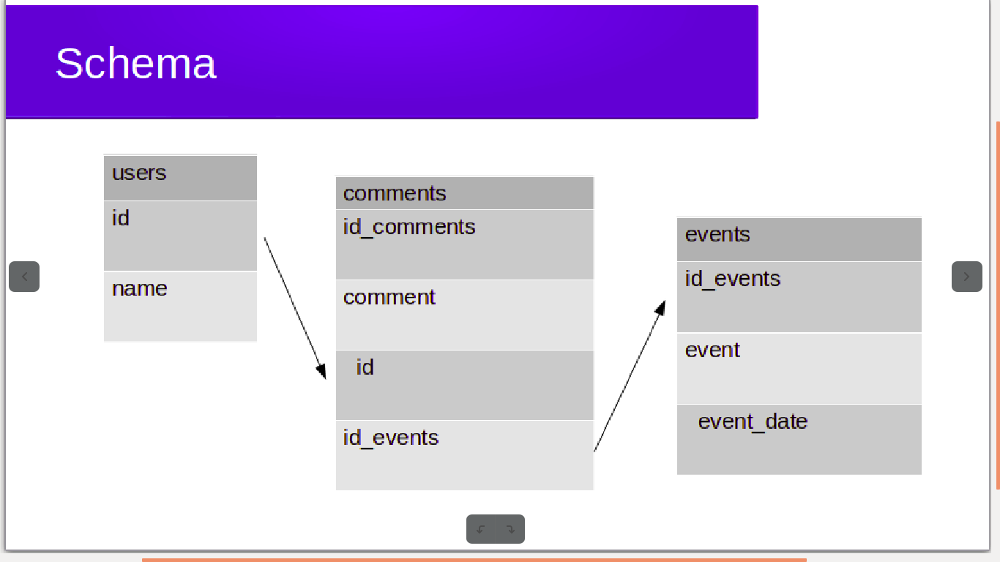

# Lotus-Events  :clipboard:

 ### Team Mates :  :two_women_holding_hands:
- ####  Sahar Saker
- #### Maha Foro

###  :tada: Welcome to our app!! :tada:
#### What it is :interrobang:
##### It is an app used to add and update events for Lotus!
##### The Lotus's participant types an event on the browser and other users can write a comments! :black_nib:

### Creating the files:
 ### :open_file_folder: public
- #### index.html
- #### style.css
- #### main.js

### :open_file_folder: src:
- #### :open_file_folder: database-files: db_build.js + db_build.sql + db_connection.js
- #### :open_file_folder: queries: getEvents.js + postEvents.js

- #### Server
- #### Router
- #### Handler

### :open_file_folder: testing:
#### test.js

### This is Schema of the data base :high_brightness:

### Contact Details : :telephone_receiver:

#### If you have any question or suggestions. please free to contact us.

 #### :large_blue_diamond: Sahar Saker : @saharsaker
 #### :large_blue_diamond: Maha Foro: @maha276

#### Hope you like it :innocent:
#### Thank you for visiting :two_hearts:
